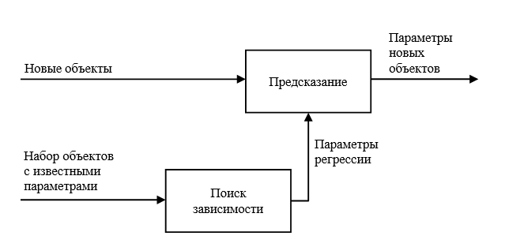

<h1 align='center'>Билет 10</h1>

1. Что такое регрессионный анализ.

    **Регрессионный анализ** — метод моделирования измеряемых данных и исследования их свойств. Данные состоят из пар значений зависимой переменной (переменной отклика) и независимой переменной (объясняющей переменной).

2. Нарисуйте схему применения регрессии (два этапа).

    

# Практика

```python
class DataAnalysis:
    '''
    Найти сумму n элементов следующего ряда чисел: 1 -0.5 0.25 -0.125 ... n.
    Количество элементов (n) вводится с клавиатуры.
    Вывести на экран каждый член ряда и его сумму.
    Решить задачу используя циклическую конструкцию for.
    '''

    def __init__(self, array=None):
        self._array = array
        self._sum = 0
        self._calcSum()

    def _calcSum(self):
        for num in self._array:
            self._sum += num
        
    def _showArray(self):
        for num in self._array:
            print(num)

    def showArrayInfo(self):
        print('Ряд:')
        self._showArray()
        print(f'Сумма: {self.sum}')

    @property
    def sum(self):
        return self._sum

    
task = DataAnalysis(list(map(int, input('-> ').split())))
task.showArrayInfo()
```