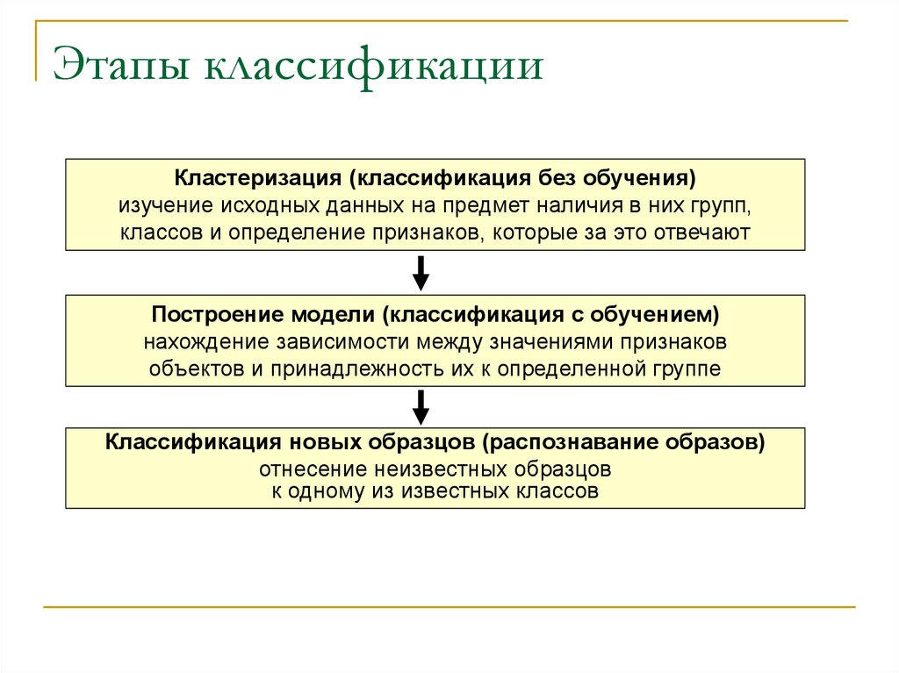

<h1 align='center'>Билет 11</h1>

1. Классификация данных – это.

    **Классификации данных** - разбиение множества объектов или наблюдений на априорно заданные группы, называемые классами, внутри каждой из которых они предполагаются похожими друг на друга, имеющими примерно одинаковые свойства и признаки.

2. Нарисуйте схему применения классификации данных.

    

# Практика

```python
class DataAnalysis:
    '''
    Дано целое число, не меньшее 2. Выведите его наименьший натуральный делитель, отличный от 1.
    '''

    def __init__(self, number=None):
        self._number = number
        self._divisor = self._calcDivisor()

    def _calcDivisor(self):
        for i in range(2, self._number + 1):
            if not self._number % i:
               return i

    @property
    def divisor(self):
        return self._divisor

    
task = DataAnalysis(94)
print(task.divisor)
```