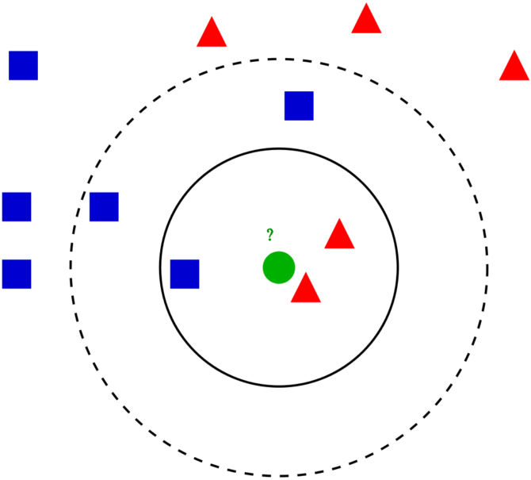

<h1 align='center'>Билет 16</h1>

1. Метод к-средних. Его принцип.

    

    Этот метод работает с помощью поиска кратчайшей дистанции между тестируемым объектом и ближайшими к нему классифицированным объектами из обучающего набора. Классифицируемый объект будет относится к тому классу, к которому принадлежит ближайший объект набора.

2. Последовательность операций метода к-средних.

    1. Выбирается число кластеров k.
    2. Из исходного множества данных случайным образом выбираются k наблюдений, которые будут служить начальными центрами кластеров.
    3. Для каждого наблюдения исходного множества определяется ближайший к нему центр кластера (расстояния измеряются в метрике Евклида). При этом записи, «притянутые» определенным центром, образуют начальные кластеры.
    4. Вычисляются центроиды — центры тяжести кластеров. Каждый центроид — это вектор, элементы которого представляют собой средние значения соответствующих признаков, вычисленные по всем записям кластера.
    5. Центр кластера смещается в его центроид, после чего центроид становится центром нового кластера.
    6. 3-й и 4-й шаги итеративно повторяются. Очевидно, что на каждой итерации происходит изменение границ кластеров и смещение их центров. В результате минимизируется расстояние между элементами внутри кластеров и увеличиваются междукластерные расстояния.

    Остановка алгоритма производится тогда, когда границы кластеров и расположения центроидов не перестанут изменяться от итерации к итерации, т.е. на каждой итерации в каждом кластере будет оставаться один и тот же набор наблюдений. На практике алгоритм обычно находит набор стабильных кластеров за несколько десятков итераций.

# Практика

```python
class DataAnalysis:
    '''
    Заполнить список квадратами чисел от 0 до 9, используя генератор списка.
    Заполнить список числами, где каждое последующее число больше на 2.
    '''

    def __init__(self):
        pass

    def getArraySquares(self):
        return self._getArraySquares()

    def _getArraySquares(self):
        return [x ** 2 for x in range(10)]

    def getArrayFromRangeWithCondition(self):
        return self._getArrayFromRangeWithCondition()

    def _getArrayFromRangeWithCondition(self):
        return [(x + 1) + x for x in range(10)]


task = DataAnalysis()
print(task.getArraySquares())
print(task.getArrayFromRangeWithCondition())
```
